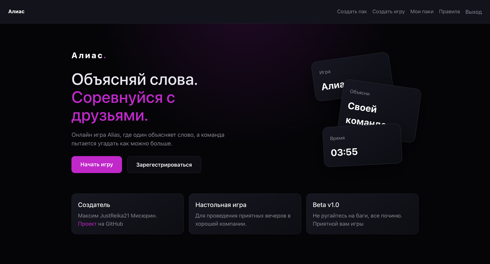
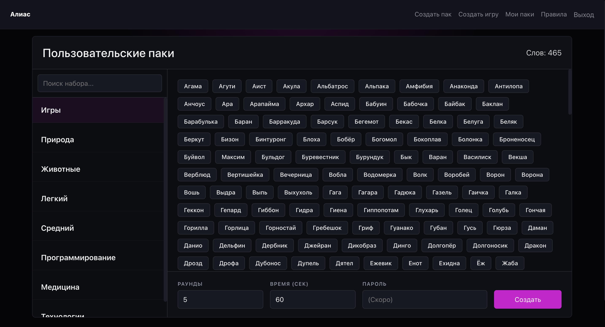
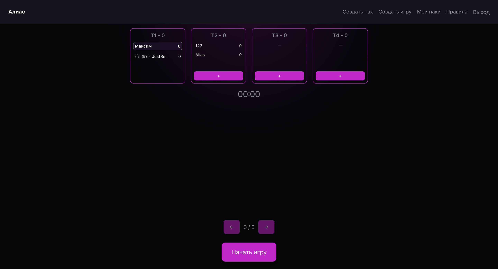
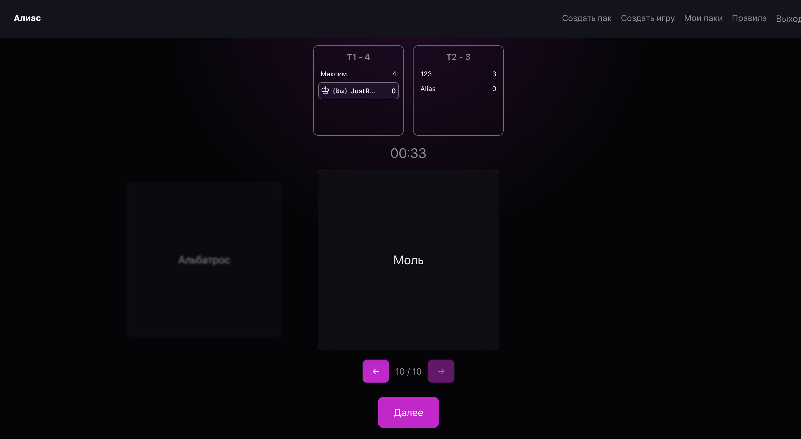

# Алиас

Многопользовательская онлайн-версия настольной игры алиас.

Игроки создают комнаты, присоединяются к существующим играм и проходят раунды в реальном времени. Приложение построено на микросервисной архитектуре.

Попробовать приложение можно [здесь](https://bloody.clayss.fvds.ru/)

## Возможности

* Регистрация и вход в аккаунт;
* Создание карт и паков
* Создание игровых комнат;
* Подключение нескольких игроков к одной игре;
* Игровой процесс с синхронизацией состояния между участниками;
* REST API для взаимодействия между клиентом и сервером;
* gRPC взаимодействия между сервисами.

## Архитектура

В проекте используются несколько независимых сервисов:

* **Auth Service** — JWT аутентификация;
* **Game Service** — игровой процесс;
* **Cards Service** — карточки со словами;
* **Packs Service** — паки с карточками;
* **API Gateway (APISIX)** — единая точка входа для клиента.

В качестве основного хранилища данных используется PostgreSQL. Redis хранит текущее состояние игровых сессий (комнаты, таймеры, карточки, ход игры и другие временные данные), а также используется для обмена событиями между сервисами через механизм Pub/Sub.

## Стек

### Backend

* Python
* FastAPI
* SQLAlchemy
* PostgreSQL
* Redis
* JWT

### Frontend

* React

### Infrastructure

* Docker
* Docker Compose
* Apache APISIX
* APISIX Dashboard

## Скриншоты

### Главная страница



### Создание игры



### Лобби



### Игра



## Запуск

1. Клонируйте репозиторий:

```bash
git clone https://github.com/JustReika21/alias_microservices
cd alias_microservices
```

2. Создайте файл `.env.dev` на основе `.env.example` и заполните необходимые переменные окружения.

3. Запустите приложение:

```bash
docker compose \
  -p dev \
  -f compose.yaml \
  -f compose.dev.yaml \
  --env-file .env.dev \
  up --build
```
4. После запуска и инициализации всех сервисов приложение будет доступно по адресу: http://localhost:5173.

## API

Каждый сервис предоставляет Swagger UI с документацией OpenAPI:

- **Cards Service:** `http://localhost:8001/docs`
- **Packs Service:** `http://localhost:8002/docs`
- **Game Service:** `http://localhost:8003/docs`
- **Auth Service:** `http://localhost:8004/docs`
